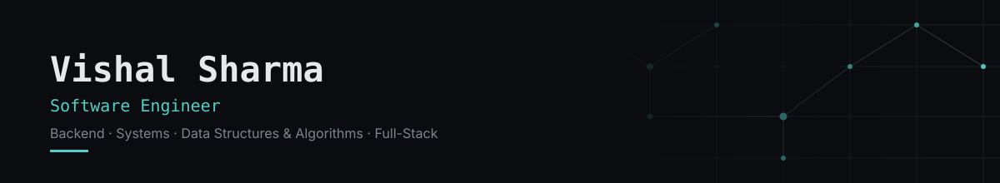

Software engineer working across backend systems, data structures & algorithms, and full-stack development — building toward stronger work in system design, distributed systems, and AI-powered applications as each project matures.

### Focus

**Backend & Systems** — API design, data modeling, architecture fundamentals
**Data Structures & Algorithms** — problem-solving as a daily practice, not a one-time prep exercise
**Full-Stack** — frontend and backend together, not just one side of the wire
**AI-powered applications** — an active area I'm building into, not yet a portfolio of shipped work

### Repository

**[java-core-foundations](https://github.com/CodewithVishal73/java-core-foundations)** — core Java language and standard library practice: OOP, collections, exception handling, Java 8 streams, multithreading, and problem-solving exercises. This is foundation work, not a flagship project — treat it as evidence of fundamentals, not the ceiling of what I build.

More repositories will appear here as they're built — this section grows with real work, not placeholders.

📫 **Contact:** [vishal.sharma.tech1@gmail.com](mailto:vishal.sharma.tech1@gmail.com) &nbsp;|&nbsp; [LinkedIn](https://linkedin.com/in/vishalsh1)
