<picture>
  <source media="(prefers-color-scheme: dark)" srcset="./dark.svg">
  <source media="(prefers-color-scheme: light)" srcset="./light.svg">
  
</picture>

<picture>
  <source media="(prefers-color-scheme: dark)" srcset="./assets/about-dark.svg">
  <source media="(prefers-color-scheme: light)" srcset="./assets/about-light.svg">
  
</picture>

<picture>
  <source media="(prefers-color-scheme: dark)" srcset="./assets/current-dark.svg">
  <source media="(prefers-color-scheme: light)" srcset="./assets/current-light.svg">
  
</picture>

Source code is kept private. Walkthrough available on request.

<picture>
  <source media="(prefers-color-scheme: dark)" srcset="./assets/projects-dark.svg">
  <source media="(prefers-color-scheme: light)" srcset="./assets/projects-light.svg">
  
</picture>

<a href="https://github.com/USERNAME/CLINIC-REPO">Repository →</a>

<picture>
  <source media="(prefers-color-scheme: dark)" srcset="./assets/stack-dark.svg">
  <source media="(prefers-color-scheme: light)" srcset="./assets/stack-light.svg">
  
</picture>

<picture>
  <source media="(prefers-color-scheme: dark)" srcset="./assets/proof-dark.svg">
  <source media="(prefers-color-scheme: light)" srcset="./assets/proof-light.svg">
  
</picture>

<picture>
  <source media="(prefers-color-scheme: dark)" srcset="./assets/certs-dark.svg">
  <source media="(prefers-color-scheme: light)" srcset="./assets/certs-light.svg">
  
</picture>

<picture>
  <source media="(prefers-color-scheme: dark)" srcset="./assets/direction-dark.svg">
  <source media="(prefers-color-scheme: light)" srcset="./assets/direction-light.svg">
  
</picture>

[LinkedIn](https://linkedin.com/in/vishalsh1) · [LeetCode](https://leetcode.com/u/Vishal_cd/)

